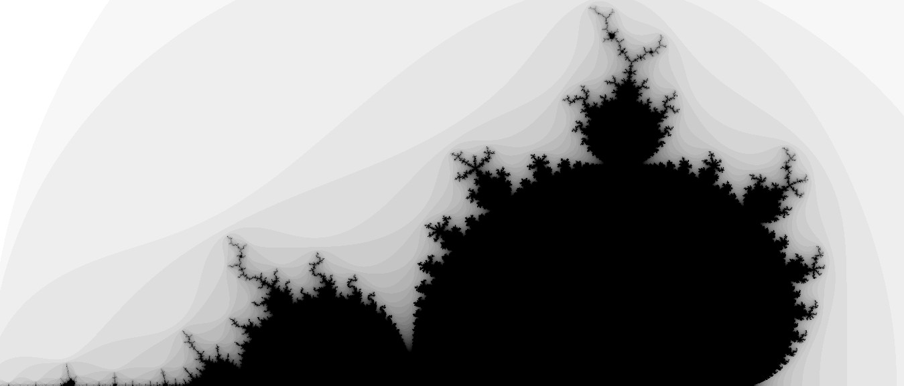

# Mandelbrot Software Renderer

Afternoon project to test SDL2's software renderer capabilities implementing a naive mandelbrot plotting algorithm.

## Controls

|            |                 |
| ---------- | --------------- |
| +/-        | Zoom in/out     |
| Arrow Keys | Move the camera |
| Quit or Q  | Exit            |

## Instructions

Compile `main.cpp` with `SDL2`.

On Linux you might run `g++ src/main.cpp -o run -lSDL2`
